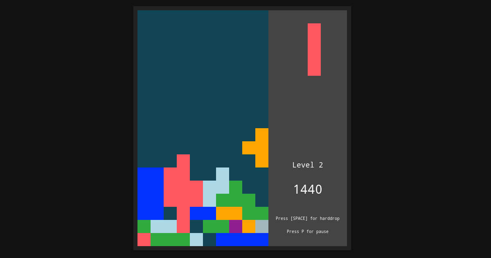

# Tetris Vanilla

An object-oriented implementation of the Tetris game, written in pure JavaScript.



## Purpose

-   learn to use this [canvas thing](https://developer.mozilla.org/en-US/docs/Web/API/Canvas_API)
-   have a fun way of using the best features of the framework-less, vanilla version of javascript. Those features are :
    -   Object-Oriented Classes, ES2015-style
    -   [JSDocs](https://github.com/jsdoc/jsdoc), the best way to document and "type" javascript
-   have fun because tetris
-   prove my value in these dire times of a global pandemic combined with a ruthless job market

## How to launch with VS Code `live server extension`

Most browsers won't allow file imports, for cross-origin requests reasons, so we got to access the entry point from a web server. However we don't want to configure apache or nginx just for developement purposes. I suggest you use the VScode [live server extemsion](https://marketplace.visualstudio.com/items?itemName=ritwickdey.LiveServer).

First of all clone this repo:

```
git clone https://github.com/Keksoj/tetris-vanilla.git
cd tetris-vanilla
code .
```

And click `Go Live`. The extension will launch a little web server that listens on `localhost:5502`, and will even open the page in your favorite browser.

### Javascript pros

EcmaScript 6 has this amazing object-oriented syntax sugar around `prototype` that allows to define classes and methods. Combined with JSDocs we can get a _clean code with no framework_ :

```js
/**
 * A group a four cells to move around
 * @typedef {object} Tetromino
 * @property {String} name
 * @property {[Number]} binaryValues
 * @property {String} color
 * @property {Number} xPosition
 * @property {Number} yPosition
 * @property {[Cell]} cells
 */
export default class Tetromino {
    // ...
}
```

### Javascript cons

This _everything-is-an-object_ feature of javascript has unforgiving consequences on the unsuspecting programmer. When clearing full tetris rows and ticking down the pile, I wanted to shift every array element like this:

```js
this.rows[y] = this.rows[y - 1];
```

Well this somehow copies the **property** of each array element together with its value (why would we need that?). When I later wanted to assign values to a row's cell :

```js
this.rows[y][x] = 'orange';
```

I had the unpleasant surprise of seeing that `this.rows[y - 1][x]` was assigned the same value! To fix this we need to perform an extra loop :

```js
for (var x = 0; x < 10; x++) {
    this.rows[y][x] = this.rows[y - 1][x];
}
```

If, like me, you like consistency, [go learn Rust](https://doc.rust-lang.org/book/foreword.html).
